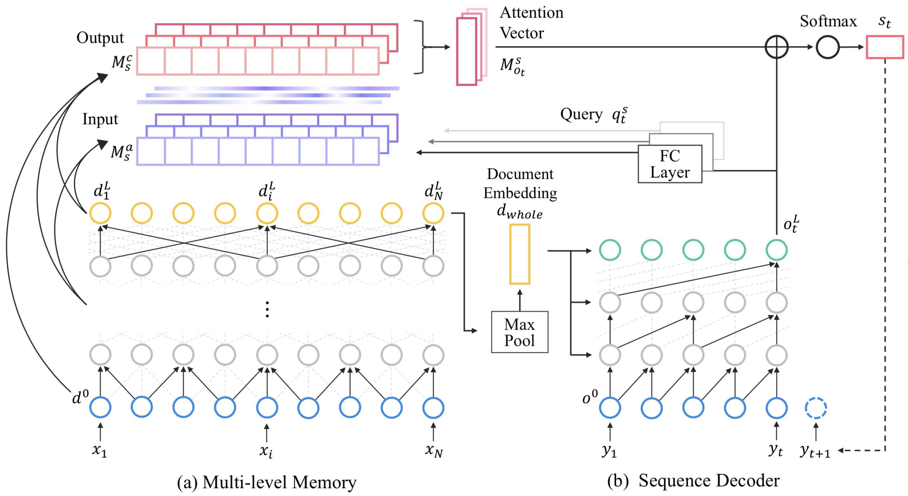

# MMN



This project hosts the code and dataset for our paper.

- Byeongchang Kim, Hyunwoo Kim and Gunhee Kim. Abstractive Summarization of Reddit Posts with Multi-level Memory Networks. In *arXiv*, 2018. [[arxiv]](https://arxiv.org/abs/1811.00783)

We address the problem of abstractive summarization in two directions: proposing a novel dataset and a new model.
First, we collected Reddit TIFU dataset, consisting of 120K posts from the online discussion forum Reddit.
Second, we propose a novel abstractive summarization model named *multi-level memory networks* (MMN), equipped with multi-level memory to store the information of text from different levels of abstraction.

## Reference

If you use this code or dataset as part of any published research, please refer following paper.

```
@inproceedings{Kim:2018:arXiv,
    author = {Kim, Byeongchang and Kim, Hyunwoo and Kim, Gunhee},
    title = "{Abstractive Summarization of Reddit with Multi-level Memory Networks}",
    booktitle = {arXiv},
    year = 2018
}
```

## Running Code

TBU

## *Reddit TIFU* Dataset

*Reddit TIFU* dataset is our newly collected Reddit dataset, where TIFU denotes the name of subbreddit [/r/tifu](https://www.reddit.com/r/tifu/).

Key statistics of *Reddit TIFU* dataset are outlined below.
We also show average and median (in parentheses) values.
The total text-summary pairs are 122,933.

| Dataset      | #posts    | #words/post | #words/summ |
|:------------:|:---------:|:-----------:|:-----------:|
| TIFU-short   | 79,949    | 342.4 (269) | 9.33 (8)    |
| TIFU-long    | 42,984    | 432.6 (351) | 23.0 (21)   |

You can download data from the links below.
This file includes raw text and tokenized text.

[[Download json]](https://drive.google.com/open?id=1ffWfITKFMJeqjT8loC8aiCLRNJpc_XnF)

You can read and exploring our dataset as follows

```python
import json

# Read entire file
posts = []
with open('tifu_tokenized_and_filtered.json', 'r') as fp:
    for line in fp:
        posts.append(json.loads(line))

# Json entries
print(posts[50000].keys())
# [u'title_tokenized',
#  u'permalink',
#  u'title',
#  u'url',
#  u'num_comments',
#  u'tldr',  # (optional)
#  u'created_utc',
#  u'trimmed_title_tokenized',
#  u'ups',
#  u'selftext_html',
#  u'score',
#  u'upvote_ratio',
#  u'tldr_tokenized',  # (optional)
#  u'selftext',
#  u'trimmed_title',
#  u'selftext_without_tldr_tokenized',
#  u'id',
#  u'selftext_without_tldr']
```

## Acknowledgement

We thank [PRAW](https://praw.readthedocs.io/en/latest/) developers for their API and Reddit users for their valuable posts.

We also appreciate [Chris Dongjoo Kim](http://vision.snu.ac.kr/people/dongjookim.html) and [Yunseok Jang](https://yunseokjang.github.io) for helpful comments and discussions.

This work was supported by Kakao and Kakao Brain corporations, and Creative-Pioneering Researchers Program through Seoul National University.

## Authors

[Byeongchang Kim](http://vision.snu.ac.kr/people/byeongchangkim.html), [Hyunwoo Kim](http://vision.snu.ac.kr/people/hyunwookim.html) and [Gunhee Kim](http://vision.snu.ac.kr/~gunhee/)

[Vision and Learning Lab](http://vision.snu.ac.kr/) @ Computer Science and Engineering, Seoul National University, Seoul, Korea

## License

MIT license
